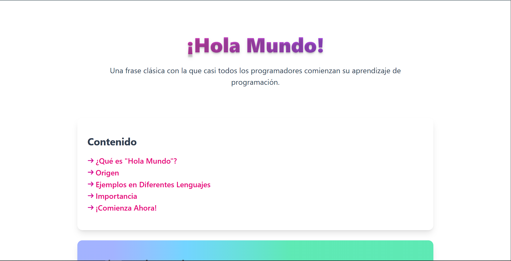

# 🌟 Tailwind CSS Web Page


## 📖 Descripción Breve

Esta es una página web estática desarrollada para demostrar el uso de **Tailwind CSS** en la creación de interfaces modernas y responsivas. El proyecto presenta una página informativa sobre el concepto de "Hola Mundo" en programación, cubriendo su definición, origen, ejemplos en varios lenguajes y su importancia en el aprendizaje de desarrollo de software.

El valor agregado radica en proporcionar una experiencia visual atractiva y educativa, utilizando únicamente HTML y Tailwind CSS sin necesidad de JavaScript, lo que la hace ligera y accesible.

## ✨ Características Principales

- 🎨 **Diseño Moderno**: Utiliza gradientes, sombras y tipografía elegante para una apariencia profesional.
- 📱 **Completamente Responsivo**: Adaptable a dispositivos móviles, tablets y desktops.
- 🚀 **Sin JavaScript**: Funciona únicamente con HTML y CSS, garantizando velocidad y simplicidad.
- 🖼️ **Elementos Visuales**: Incluye listas con íconos personalizados y bloques de código resaltados.
- 🌈 **Paleta de Colores Dinámica**: Gradientes y colores vibrantes para destacar secciones clave.
- 📖 **Contenido Educativo**: Explica conceptos de programación de manera amena y accesible.

## 🖼️ Demo/Vistas Previas



Para ver la demo en vivo, abre `index.html` en tu navegador web preferido  o visita la [demo en vivo](https://seb-rm.github.io/Tailwind_Css_Html_Js-Movie-Web-App/).

## 🛠️ Tecnologías Utilizadas

| Tecnología | Versión | Descripción |
|------------|---------|-------------|
|  | 5 | Estructura semántica de la página |
|  | 4.1.11 | Framework CSS para estilos utilitarios |
|  | 3 | Estilos personalizados y animaciones |

## 🚀 Instalación y Configuración

### Prerrequisitos

- Navegador web moderno (Chrome, Firefox, Safari, Edge)
- Conexión a internet para cargar fuentes y posibles recursos externos

### Instalación

1. Clona este repositorio:

   ```bash
   git clone https://github.com/tu-usuario/tailwind-css-web-page.git
   cd tailwind-css-web-page
   ```

2. Abre el archivo `src/index.html` en tu navegador web preferido.

### Configuración (Opcional)

Si deseas modificar los estilos:

1. Instala Node.js y npm si no los tienes.
2. Instala las dependencias:

   ```bash
   npm install
   ```

3. Modifica `src/input.css` y recompila:

   ```bash
   npx tailwindcss -i src/input.css -o src/output.css --watch
   ```

No se requieren variables de entorno ni configuraciones adicionales para el funcionamiento básico.

## 📚 Guía de Uso

### Visualización Básica

- Abre `src/index.html` en cualquier navegador.
- Navega por las secciones usando los enlaces en el menú de contenido.
- La página es completamente estática y no requiere servidor.

### Personalización

- Edita el contenido HTML en `src/index.html`.
- Modifica estilos en `src/input.css` y recompila con Tailwind.
- Reemplaza imágenes en `src/images/` manteniendo los nombres de archivo.

### Casos de Uso

- **Educativo**: Como ejemplo para cursos de HTML/CSS.
- **Portfolio**: Base para páginas personales o de proyectos.
- **Demo**: Presentación rápida de conceptos de Tailwind CSS.

## ⚙️ Explicación Técnica

### 📁 `src/index.html`

**Propósito**: Archivo principal que define la estructura y contenido de la página web.

**Conceptos Clave**:

- Estructura semántica HTML5 (header, nav, section, footer)
- Enlaces internos con anclas (#)
- Elementos de lista personalizados con imágenes
- Bloques de código con resaltado sintáctico básico

**Fragmentos Destacados**:

```html
<header class="text-center py-10 px-6 mb-6">
    <h1 class="text-5xl font-extrabold mb-6 bg-gradient-to-r from-pink-500 to-violet-500 bg-clip-text text-transparent text-shadow-lg">¡Hola Mundo!</h1>
    <p class="text-lg text-gray-600 mt-2">
        Una frase clásica con la que casi todos los programadores comienzan su
        aprendizaje de programación.
    </p>
</header>
```

Este fragmento muestra el encabezado principal con gradiente de texto aplicado via Tailwind CSS.

**API/DOM**: No utiliza JavaScript, por lo que no hay manipulación del DOM. Los estilos se aplican directamente en el HTML usando clases de Tailwind.

### 📁 `src/input.css`

**Propósito**: Archivo de entrada para Tailwind CSS que importa las directivas base.

**Conceptos Clave**:

- Directiva `@import` para cargar Tailwind
- Configuración mínima para utilidades básicas

**Fragmentos Destacados**:

```css
@import "tailwindcss";
```

Esta línea importa todas las utilidades de Tailwind CSS.

**API/DOM**: No aplica, es configuración estática.

### 📁 `src/output.css`

**Propósito**: Archivo CSS compilado generado por Tailwind CSS con todas las utilidades utilizadas.

**Conceptos Clave**:

- CSS compilado con solo las clases usadas (tree-shaking)
- Variables CSS personalizadas para colores y espaciado
- Capas de Tailwind (@layer) para organización

**Fragmentos Destacados**:

```css
@layer utilities {
  .bg-gradient-to-r {
    --tw-gradient-position: to right in oklab;
    background-image: linear-gradient(var(--tw-gradient-stops));
  }
  .from-pink-500 {
    --tw-gradient-from: var(--color-pink-500);
    --tw-gradient-stops: var(--tw-gradient-via-stops, var(--tw-gradient-position), var(--tw-gradient-from) var(--tw-gradient-from-position), var(--tw-gradient-to) var(--tw-gradient-to-position));
  }
}
```

Muestra cómo se implementan los gradientes en Tailwind CSS usando variables CSS.

**API/DOM**: No aplica, es CSS estático.

### 📁 `src/images/`

**Propósito**: Carpeta que contiene recursos visuales utilizados en la página.

- `Captura-TailwindWebPage.PNG`: Captura de pantalla para el README.
- `maki-arrow.svg`: Ícono SVG utilizado en las listas de navegación.

## 🎯 Arquitectura

La arquitectura es simple y plana, adecuada para una página estática:

```text
tailwind-css-web-page/
├── src/
│   ├── index.html          # Página principal
│   ├── input.css           # Entrada Tailwind
│   ├── output.css          # CSS compilado
│   └── images/             # Recursos visuales
├── README.md               # Documentación
├── package.json            # Dependencias Node.js
└── .gitignore              # Archivos ignorados por Git
```

**Patrones Implementados**:

- **Utility-First CSS**: Uso extensivo de clases utilitarias de Tailwind.
- **Mobile-First**: Diseño responsivo comenzando desde móviles.
- **Component-Based**: Secciones como bloques reutilizables.

**Flujo de Datos**: Estático - HTML → CSS → Renderizado en navegador.

---
